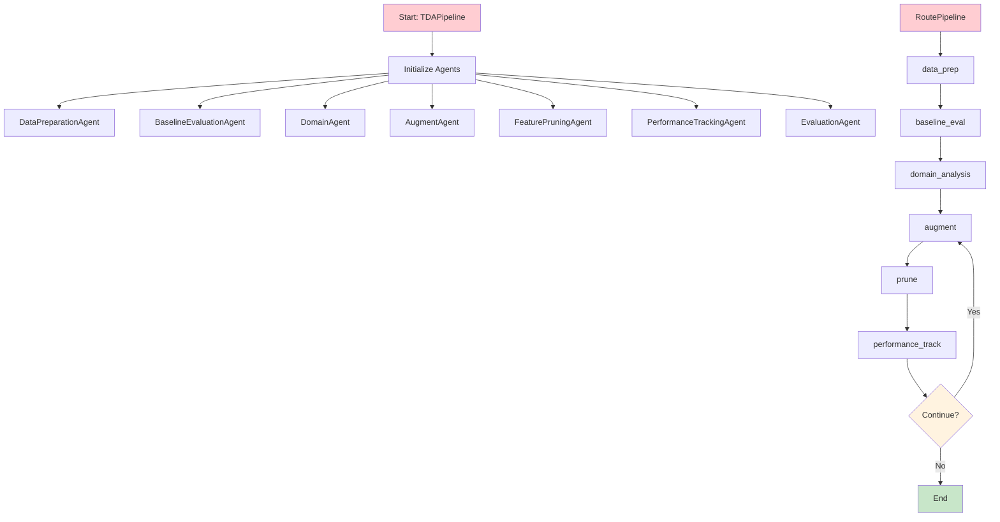
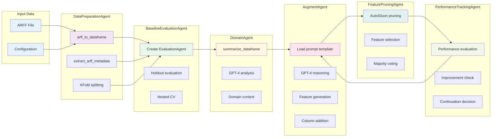
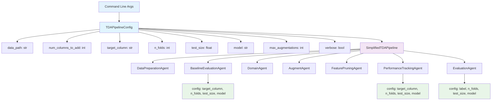
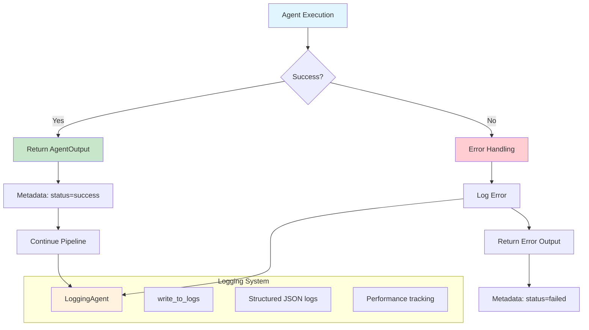

# TDA Pipeline Architecture Flowchart

## Simplified Pipeline (Working)

```mermaid
flowchart TD
    A[Start: run_agents.py] --> B[Create TDAPipelineConfig]
    B --> C[Initialize SimplifiedTDAPipeline]
    
    C --> D[DataPreparationAgent]
    D --> D1[Load ARFF file]
    D1 --> D2[Extract metadata]
    D2 --> D3[Create CV folds]
    D3 --> D4[Save fold indices]
    
    D4 --> E[BaselineEvaluationAgent]
    E --> E1[Create EvaluationAgent]
    E1 --> E2[Test on holdout]
    E2 --> E3[Nested CV evaluation]
    E3 --> E4[Calculate baseline score]
    
    E4 --> F[DomainAgent]
    F --> F1[Analyze dataset]
    F1 --> F2[Generate domain context]
    F2 --> F3[Extract column descriptions]
    
    F3 --> G[AugmentAgent]
    G --> G1[Load reasoning prompt]
    G1 --> G2[Generate feature suggestions]
    G2 --> G3[Execute feature generation]
    G3 --> G4[Add new columns]
    
    G4 --> H[FeaturePruningAgent]
    H --> H1[Perform feature selection]
    H1 --> H2[AutoGluon pruning]
    H2 --> H3[Majority vote selection]
    
    H3 --> I[PerformanceTrackingAgent]
    I --> I1[Evaluate pruned dataset]
    I1 --> I2[Compare with previous]
    I2 --> I3[Decide continuation]
    
    I3 --> J{Continue?}
    J -->|Yes| F
    J -->|No| K[Final Evaluation]
    
    K --> L[Save Results]
    L --> L1[Save augmented columns]
    L1 --> L2[Log performance history]
    L2 --> M[End]
    
    style A fill:#e1f5fe
    style M fill:#c8e6c9
    style J fill:#fff3e0
    style D fill:#f3e5f5
    style E fill:#e8f5e8
    style F fill:#fff8e1
    style G fill:#fce4ec
    style H fill:#e0f2f1
    style I fill:#f1f8e9
```



## Route-Based Pipeline (Has Data Flow Issues)



## Agent Data Flow



## Data Types and Interfaces

```mermaid
flowchart TD
    subgraph "Agent Input/Output Pattern"
        A[AgentInput] --> A1[data: Any]
        A --> A2[metadata: Dict]
        
        B[AgentOutput] --> B1[result: Any]
        B --> B2[metadata: Dict]
    end
    
    subgraph "DataPreparationAgent"
        C[DataPreparationInput]
        C1[data_path: str]
        C2[n_folds: int]
        C3[random_state: int]
        
        D[DataPreparationOutput]
        D1[df: DataFrame]
        D2[metadata: str]
        D3[fold_indices: list]
        D4[original_columns: list]
    end
    
    subgraph "BaselineEvaluationAgent"
        E[BaselineEvaluationInput]
        E1[df: DataFrame]
        E2[target_column: str]
        E3[n_folds: int]
        E4[test_size: float]
        E5[model: str]
        
        F[BaselineEvaluationOutput]
        F1[original_eval: float]
        F2[original_nested_cv_scores: List]
        F3[baseline_score: float]
    end
    
    subgraph "EvaluationAgent"
        G[EvaluationInput]
        G1[df: DataFrame]
        G2[target_column: str]
        G3[evaluation_type: str]
        G4[n_splits: int]
        G5[device: str]
        
        H[EvaluationOutput]
        H1[scores: List[float]]
        H2[mean_score: float]
        H3[std_score: float]
        H4[evaluation_type: str]
        H5[n_splits: int]
    end
    
    A --> C
    D --> E
    F --> G
    H --> B
    
    style A fill:#e1f5fe
    style B fill:#c8e6c9
    style C fill:#f3e5f5
    style D fill:#f3e5f5
    style E fill:#e8f5e8
    style F fill:#e8f5e8
    style G fill:#fff8e1
    style H fill:#fff8e1
```

## Configuration Flow



## Error Handling and Logging



## Key Benefits of Refactored Architecture

1. **Modularity**: Each agent has a single responsibility
2. **Testability**: Individual agents can be tested in isolation
3. **Maintainability**: Clear separation of concerns
4. **Flexibility**: Multiple pipeline implementations
5. **Reusability**: Agents can be used in different workflows
6. **Standardization**: Consistent input/output patterns
7. **Error Handling**: Proper error propagation and logging
8. **Configuration**: Centralized configuration management

## Current Status

- ✅ **SimplifiedTDAPipeline**: Working correctly
- ❌ **TDAPipeline**: Has data flow issues between agents
- ✅ **Individual Agents**: All properly implemented
- ✅ **Data Flow**: Clean and predictable in simplified pipeline
- ✅ **Testing**: Comprehensive test coverage available
- ✅ **Documentation**: Complete architecture documentation
